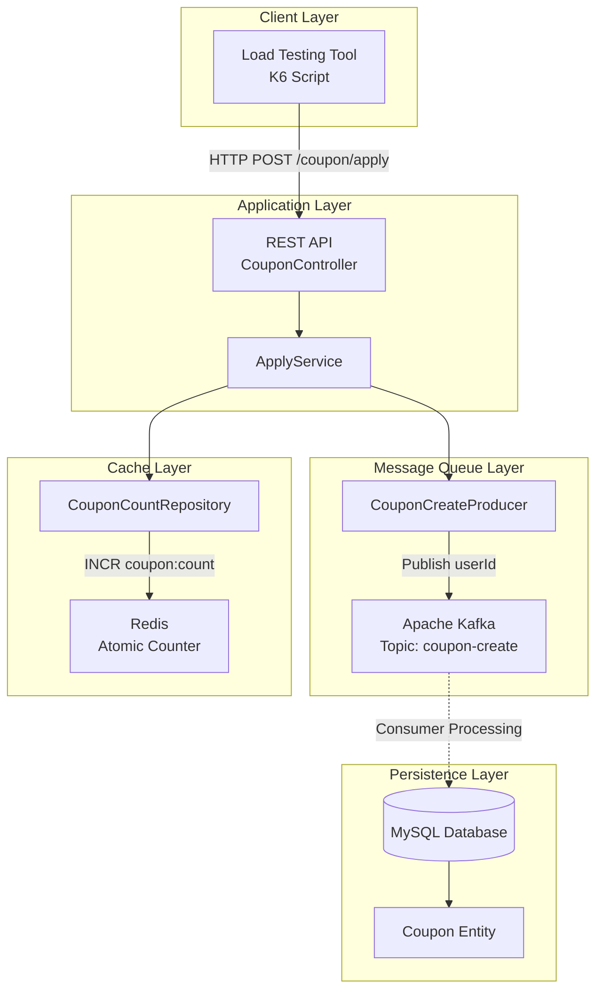
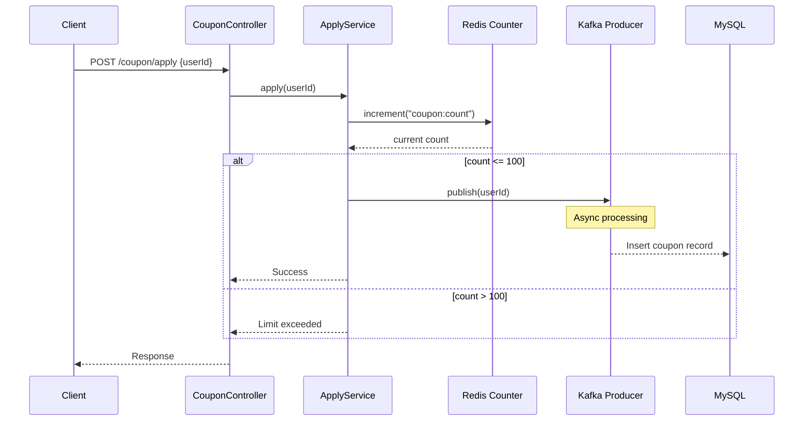
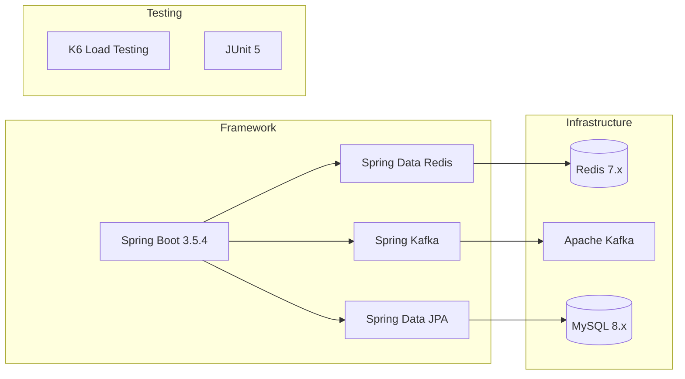

# Coupon Concurrency System

## Overview

선착순 쿠폰 발급 시스템의 동시성 처리를 위한 분산 아키텍처 구현체입니다. 대용량 트래픽 환경에서 정확한 쿠폰 발급 개수 제어와 시스템 안정성을 보장하기 위해 Redis와 Apache Kafka를 활용한 비동기 처리 패턴을 적용했습니다.

## System Architecture



## Core Components

### 1. Concurrency Control Flow



### 2. Technology Stack



## Key Design Patterns

### Atomic Counter Pattern
- Redis INCR 명령어를 통한 원자적 카운터 증가
- 동시성 환경에서 정확한 발급 개수 제어
- Race Condition 방지

### Producer-Consumer Pattern
- Kafka를 통한 비동기 메시지 처리
- 데이터베이스 부하 분산
- 시스템 간 느슨한 결합

### Configuration Management
- `KafkaProducerConfig`: Kafka 프로듀서 설정 및 직렬화 구성
- `RedisConfig`: Redis 연결 및 직렬화 설정

## Project Structure

```
src/main/java/com/f1v3/coupon/
├── config/
│   ├── KafkaProducerConfig.java    # Kafka 프로듀서 설정
│   └── RedisConfig.java            # Redis 연결 설정
├── controller/
│   └── CouponController.java       # REST API 엔드포인트
├── service/
│   └── ApplyService.java           # 비즈니스 로직
├── repository/
│   ├── CouponCountRepository.java  # Redis 카운터 조작
│   └── CouponRepository.java       # JPA Repository
├── producer/
│   └── CouponCreateProducer.java   # Kafka 메시지 발행
├── domain/
│   └── Coupon.java                 # JPA Entity
└── dto/
    └── UserRequest.java            # API 요청 DTO
```

## Performance Testing

### Load Test Configuration
- **Tool**: K6
- **Virtual Users**: 5,000
- **Duration**: 30 seconds
- **Target**: 동시성 환경에서의 정확한 쿠폰 발급 제한

### Test Scenario
```javascript
// 매 요청마다 고유한 사용자 ID 생성
const userId = timestamp + random + __VU * 1000000;

// 쿠폰 발급 API 호출
http.post('http://localhost:8080/coupon/apply', payload);
```

## Environment Setup

### Dependencies
- Java 21
- Spring Boot 3.5.4
- MySQL 8.x
- Redis 7.x
- Apache Kafka

### Database Configuration
```yaml
spring:
  datasource:
    url: jdbc:mysql://localhost:3306/coupon
    username: coupon_user
    password: coupon_password
  data:
    redis:
      host: localhost
      port: 6379
```

## Business Logic

### Coupon Issuance Flow
1. **Request Validation**: 사용자 요청 수신
2. **Atomic Counting**: Redis INCR로 발급 카운터 증가
3. **Limit Check**: 발급 한도(100개) 검증
4. **Async Processing**: Kafka를 통한 비동기 쿠폰 생성
5. **Database Persistence**: MySQL에 쿠폰 정보 저장

### Concurrency Handling
- Redis의 단일 스레드 특성을 활용한 원자적 연산
- Kafka 비동기 처리로 데이터베이스 부하 분산
- Producer 패턴으로 시스템 확장성 확보

## Testing

### Unit Test Execution
```bash
./gradlew test
```

### Load Test Execution
```bash
k6 run k6/coupon-apply-script.js
```

## Monitoring Points

- Redis 카운터 정확성
- Kafka 메시지 처리 지연시간
- MySQL 연결 풀 사용률
- API 응답 시간 분포
